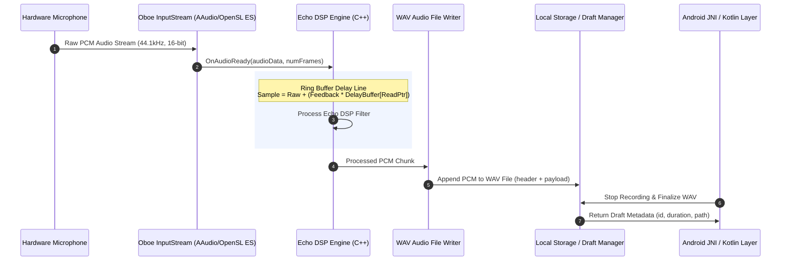

# Audio Flow Architecture - ROXSTAR Oboe & Web Audio DSP

## Native Oboe C++ Audio Processing Pipeline

## Audio Engine Specifications

- **Native Library**: Google Oboe (C++17)
- **Audio Format**: 16-bit PCM Mono / Stereo, 44,100 Hz
- **DSP Effect**: Circular Ring-Buffer Echo (Delay time: 50ms - 800ms, Feedback: 0.0 - 0.8)
- **Web Equivalent**: Web Audio API `DelayNode`, `GainNode`, and `MediaRecorder`
