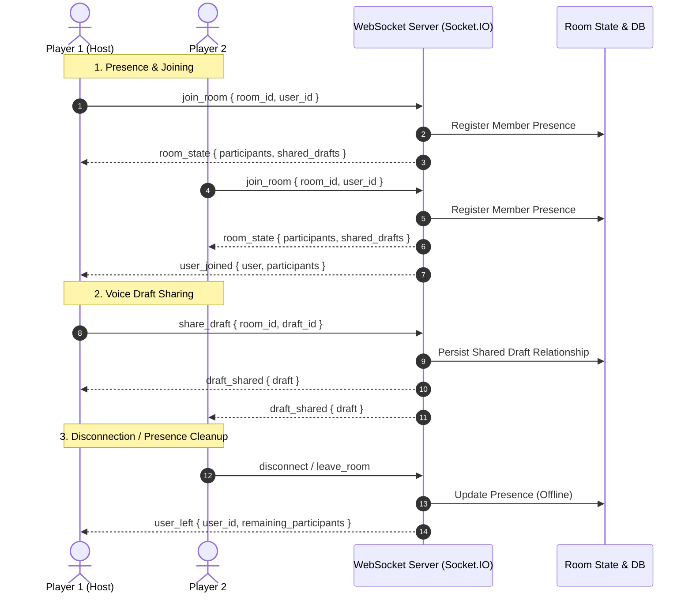

# Real-Time WebSocket Event Flow

```mermaid
sequenceDiagram
    autonumber
    actor Client1 as Player 1 (Host)
    actor Client2 as Player 2
    participant Gateway as WebSocket Server (Socket.IO)
    participant RoomState as Room State & DB

    Note over Client1, Client2: 1. Presence & Joining
    Client1->>Gateway: join_room { room_id, user_id }
    Gateway->>RoomState: Register Member Presence
    Gateway-->>Client1: room_state { participants, shared_drafts }
    
    Client2->>Gateway: join_room { room_id, user_id }
    Gateway->>RoomState: Register Member Presence
    Gateway-->>Client2: room_state { participants, shared_drafts }
    Gateway-->>Client1: user_joined { user, participants }

    Note over Client1, Client2: 2. Voice Draft Sharing
    Client1->>Gateway: share_draft { room_id, draft_id }
    Gateway->>RoomState: Persist Shared Draft Relationship
    Gateway-->>Client1: draft_shared { draft }
    Gateway-->>Client2: draft_shared { draft }

    Note over Client1, Client2: 3. Disconnection / Presence Cleanup
    Client2->>Gateway: disconnect / leave_room
    Gateway->>RoomState: Update Presence (Offline)
    Gateway-->>Client1: user_left { user_id, remaining_participants }
```
