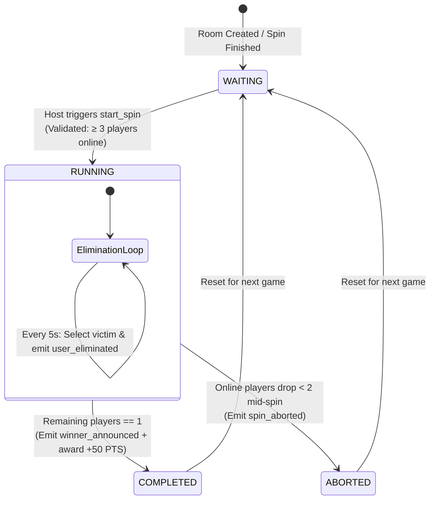

# Spin Wheel State Machine - ROXSTAR Platform

## State Transition Diagram

## Implemented Edge Cases Matrix

| Edge Case | Description | Handled Behavior | Status |
|---|---|---|---|
| **E1** | Non-Host Trigger Attempt | Rejects request with status code `403` / `ONLY_HOST_ALLOWED` error event. | ✅ Handled |
| **E2** | Insufficient Players (< 3) | Prevents start, emits `MINIMUM_3_PLAYERS_REQUIRED` error notification. | ✅ Handled |
| **E3** | Duplicate Spin Request | Rejects concurrent start requests with `SPIN_ALREADY_ACTIVE` status. | ✅ Handled |
| **E4** | User Disconnect Mid-Spin | If active player drops, marks user eliminated. If room drops < 2 players, aborts spin safely. | ✅ Handled |
| **E5** | Late Reconnection | Rejoining user receives full active spin state snapshot via `room_state` socket broadcast. | ✅ Handled |
| **E6** | Host Disconnect Mid-Spin | Spin elimination timer continues autonomously on backend; state stays synchronized. | ✅ Handled |
